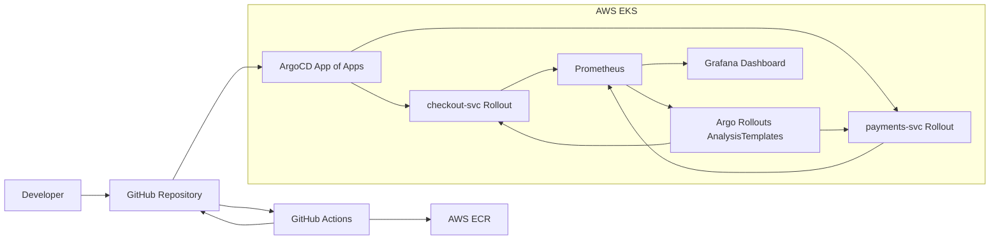

# DriftGuard

DriftGuard is a GitOps continuous-delivery portfolio project for AWS EKS. Terraform creates the AWS foundation, ArgoCD reconciles Kubernetes state from Git, Argo Rollouts performs canary and blue-green releases, and Prometheus gates promotions with real service metrics.

## Architecture



## What Is Included

- Terraform for VPC, EKS, managed node group, ECR, GitHub OIDC, and EKS IRSA.
- `checkout-svc`, a Go HTTP service deployed with a metric-gated canary rollout.
- `payments-svc`, a Go HTTP service deployed with blue-green and pre-promotion analysis.
- Helm charts with Rollouts, Services, AnalysisTemplates, and ServiceMonitors.
- ArgoCD app-of-apps manifests for dev and prod.
- kube-prometheus-stack values and a Grafana dashboard JSON.
- GitHub Actions for service CI/CD and Terraform validation/apply.

## Required Replacements

Before deploying, replace these placeholders:

- `REPLACE_WITH_TERRAFORM_STATE_BUCKET` in [terraform/backend.tf](/home/arnab/CODE/driftgaurd/terraform/backend.tf)
- `REPLACE_WITH_TERRAFORM_LOCK_TABLE` in [terraform/backend.tf](/home/arnab/CODE/driftgaurd/terraform/backend.tf)
- `REPLACE_WITH_ACCOUNT_ID` in chart values files
- `https://github.com/Arnazz10/DriftGuard.git` in ArgoCD manifests
- `Arnazz10` in Terraform variables or tfvars
- `REPLACE_WITH_TEMPORARY_BOOTSTRAP_PASSWORD` in observability values

No secrets, AWS account IDs, or concrete ARNs are committed.

## Run

```bash
cd terraform
terraform init
terraform plan -var-file=environments/dev.tfvars
terraform apply -var-file=environments/dev.tfvars
aws eks update-kubeconfig --name driftguard-dev --region us-east-1
```

Seed the first images:

```bash
aws ecr get-login-password --region us-east-1 \
  | docker login --username AWS --password-stdin <acct>.dkr.ecr.us-east-1.amazonaws.com

docker build -t checkout-svc:v1 apps/checkout-svc
docker tag checkout-svc:v1 <acct>.dkr.ecr.us-east-1.amazonaws.com/checkout-svc:v1
docker push <acct>.dkr.ecr.us-east-1.amazonaws.com/checkout-svc:v1

docker build -t payments-svc:v1 apps/payments-svc
docker tag payments-svc:v1 <acct>.dkr.ecr.us-east-1.amazonaws.com/payments-svc:v1
docker push <acct>.dkr.ecr.us-east-1.amazonaws.com/payments-svc:v1
```

Install controllers:

```bash
bash scripts/bootstrap.sh
kubectl apply -f argocd/bootstrap/root-app.yaml
```

Verify:

```bash
kubectl get applications -n argocd
kubectl get rollouts -A
kubectl get servicemonitors -A
```

## Demos

The step-by-step demo script notes are in [docs/demos.md](/home/arnab/CODE/driftgaurd/docs/demos.md):

- Successful canary promotion for `checkout-svc`
- Blue-green preview and promotion for `payments-svc`
- Automatic rollback from metric breach using `FAIL_RATE`
- ArgoCD self-heal after manual drift

## Version Ledger

All pinned versions and rationale are recorded in [VERSIONS.md](/home/arnab/CODE/driftgaurd/VERSIONS.md).

